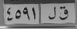
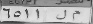
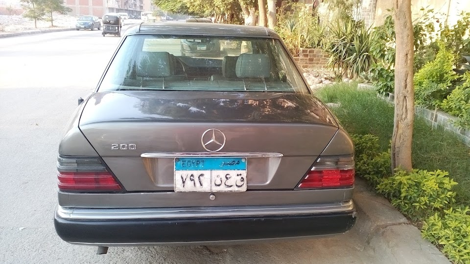
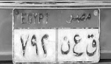

# Arabic License Plate Recognition

This project is an implementation of arabic license plate recognition. It is a group project in university. The project is divide into two parts. The first part is [Plate detection](plate_detection.py) part and the second part is [Character recognition](character_recognition.py) part.

## Getting started

These instructions will get you a copy of the project up and running on your local machine for development and testing purposes

## Installation

### Requirements

- Python 3.9.12
- OpenCV
- Numpy
- Matplotlib
- Scikit-learn

### Installation

- Download and install python
- py -3.9 -m pip install numpy==1.21.2
- py -3.9 -m pip install opencv-python==4.5.4.60
- py -3.9 -m pip install opencv-contrib-python==4.5.4.60

## How to run

### Dataset

All in the input images are in the [Allworking](allworking) folder. The images are taken from the internet.

### Steps

In the file [main.ipynb](main.ipynb) file, you can run the code by running the cells in order.

## Example of the results

### First output

The first output from the plate detection cell in main.ipynb are images in [outputPlateDetection](outputPlateDetection) folder. The images are the detected plates.

### Second output

Each plate is detected and the characters are recognized. The results are shown in the following figure.
The format of showing the image

- The original image
- The detected plate
- The recognized characters
  

1. 

- 
- Plate Number : ق ل ١ ٩ ٥ ٤

2. 

- 
- Plate Number : م ل ١ ١ ٥ ٦

3. 

- 
- Plate Number : ق ع ن ٢ ٩ ٧

## Contributors

- [Abdallah Marzouk](https://github.com/abdallahwaseem)
- [Karim Khalifa](https://github.com/Karim-T-Khalifa)
- [Youssef Tarek](https://github.com/BoJo30)
- [Abdallah Fawzy](https://github.com/Abdallahfawzyy)
